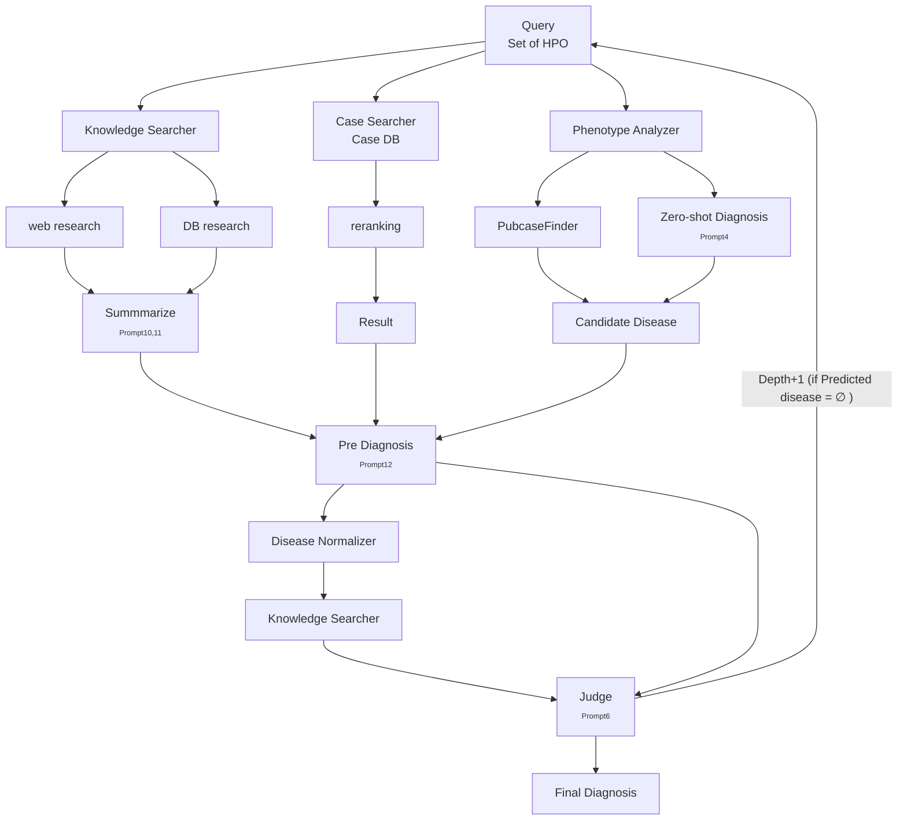

# RareDiseaseAgentGCP
mock of AI agents for diagnosis of rare disease on GCP.

## フロー図（Mermaid記法）

```mermaid
flowchart TD
    Q["Query<br>Set of HPO"] --> KS["Knowledge Searcher"]
    KS --> WS["web research"]
    KS --> DBS["DB research"]
    WS --> S["Summmarize<br><span style='font-size:10px'>Prompt10,11</span>"]
    DBS --> S
    Q --> CS["Case Searcher<br>Case DB"]
    Q --> PA["Phenotype Analyzer"]
    PA --> ZD["Zero-shot Diagnosis<br><span style='font-size:10px'>Prompt4</span>"]
    PA --> PC["PubcaseFinder"]
    PC --> CD
    ZD --> CD["Candidate Disease"]
    CS --> RR["reranking"]
    RR --> R["Result"]
    S --> PD["Pre Diagnosis<br><span style='font-size:10px'>Prompt12</span>"]
    R --> PD
    CD --> PD
    PD --> DN["Disease Normalizer"]
    DN --> KSR["Knowledge Searcher"]
    KSR --> J["Judge<br><span style='font-size:10px'>Prompt6</span>"]
    PD --> J
    J --> FD["Final Diagnosis"]
    J -- "Depth+1 (if Predicted disease = ∅ )" --> Q
    
    %% 矢印の色や深さの表現はMermaidでは省略
    %% 青色のループや赤色はコメントで補足
```

※ 青色の矢印は「Depth +1」などのループや深掘りを示し、赤色は診断フローの主経路を示っています。
